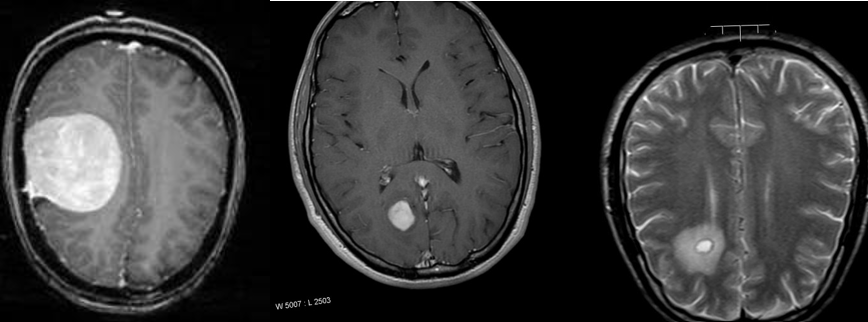
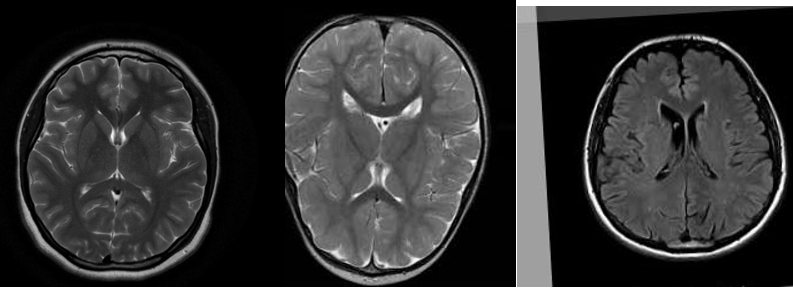
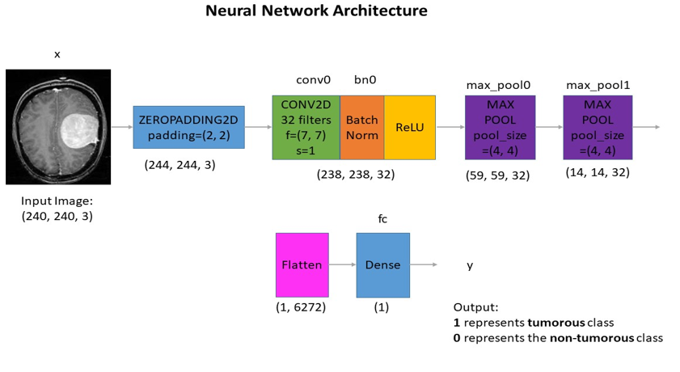
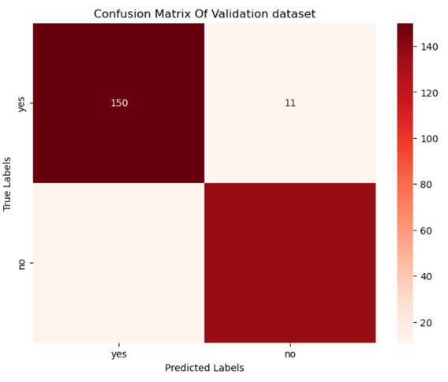
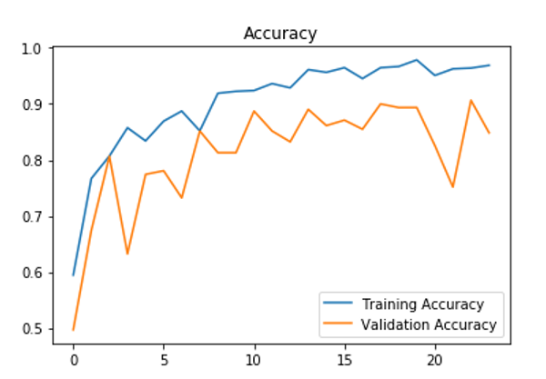
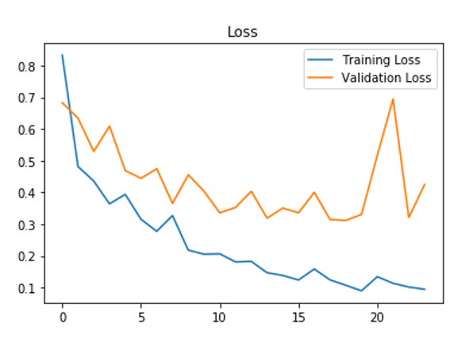

# Brain Tumor Detection using CNN

Brain tumors are abnormal growth of cells within the brain. These growths can be cancerous (malignant) or non-cancerous(benign). Malignant tumors are more aggressive and can invade healthy brain issues, while benign tumors typically grow slower and are less likely to spread. Here is the breakdown of the types of brain tumor.

- Gliomas
- Meningiomas
- Pituitary

## Gliomas:
These are the most frequent type of primary brain tumor. Accounting for 80% of all cells. They arise from the glial cell. Which support and nourish neurons.

## Meningiomas:
These are benign tumors arising from meninges. The protective membrane surrounding the brain and spinal cord. They are typically slow growing and rarely becomes cancerous.

## Pituitary:
These develop in pituitary gland, a small gland at  the base of the brain that produces hormone. Pituitary tumors can be benign or malignant and may cause hormonal imbalances.

### Importance of an early detection:
Early detection of brain tumors is crucial for effective treatment and improving patient outcomes. Symptoms of brain tumors can vary depending on the location and size of the tumor, common symptoms may include headaches, seizures, vision problems, weakness, and difficulty speaking.

### MRI Scans: A powerful tool for brain tumor analysis:
Magnetic resonance imaging scans play a critical role in brain tumor analysis. They offer a non-invasive and detailed view of the brain tissue. It is mainly used for:

- Visualize brain structures: MRI scans provide high-resolution images of the brain, revealing abnormalities like tumors, inflammation, or bleeding
- Differentiate tumor types: The detailed image can help distinguish between different type of tumors based on their appearance and signal characteristics.
- Determine tumor location and size: MRIs accurately pinpoint the location and size of a tumor, which is crucial for the treatment planning.
- Monitor treatment progress: Serial MRI scans can be used to monitor the effectiveness of treatment by tracking changes in tumor size and overall brain health
Project Objectives and Achieved Accuracy:
The primary objective of this project was to design, implement, and evaluate convolutional neural network for detecting tumors in MRI images.
- Data collection and preprocessing: Assembled the comprehensive and crystal clear dataset from the Kaggle for training purpose. And distributed that dataset according to the 80/20 rule.
- Model Design and implementation: Develop a CNN architecture optimized for the tumor detection, this included selecting appropriate layer, activation function and optimization techniques tailored to the medical imaging domain.
- Evaluation and comparison: Evaluate the model using relevant metrics such as accuracy, precision, recall, and F1-score.
Achieved accuracy:
After extensive experimentation and optimization, The final CNN model achieved an accuracy of 91% on the validation dataset. Additional evaluation metrics such as precision, recall, and F1-score were also computed, confirming the model’s reliability and generalization capability in identifying tumors.

# Literature Review

In recent years, Convolutional Neural Networks (CNNs) have become a cornerstone in the field of medical image analysis. Various studies have demonstrated the efficacy of CNNs in detecting and classifying brain tumors from MRI scans. For instance, Pereira et al. (2016) achieved significant accuracy in brain tumor segmentation using deep learning techniques. Similarly, Kamnitsas et al. (2017) utilized a 3D CNN approach for the segmentation of brain lesions, showing the robustness of CNNs in handling medical images. Despite these advancements, there remains a gap in the application of CNNs to classify multiple types of brain tumors with high accuracy. This study aims to address this gap by developing a CNN model capable of classifying glioma, meningioma, pituitary tumors, and non-tumorous images.

# Methodology

In this section, We present the methodology employed for detecting tumors Using a convolutional neural network (CNN). Our approach involves the data collection, preprocessing, designing the CNN architecture, training the model, and evaluating its process. 

### Data source and pre processing

The dataset was sourced from Kaggle repository, obtaining labeled MRI. Scan of brain tumors categorized into Yes (Malignant tumor) or No (Benign tumor). The dataset consists of the around 250 images. Each image either belongs to the malignant category or the benign category.  All of the images were resized to 240x240. Moreover, to increase the accuracy of our model we have performed the data augmentation in our dataset. We have performed rotation, horizontal and vertical flips by this technique our dataset was increased to 2,065 images. Some of images from our dataset are following:

The above images belong to the malignant class.

Above images belong to the benign class.

### CNN Architecture

Now let’s discuss about our CNN architecture. It is very crucial to understand about how our model is classifying images. Our model is designed using the Keras Sequential Model and it consists of the several layer that transforms the input image to predict the presence or absence of a tumor. Below is a detailed explanation of each layer along with its function and output shape. The architecture diagram is also provided.

### Input Layer

The input to the model is an image of shape (240, 240, 3). Which represents the height, width, and the number of colors channels in this case the color channel of RGB is selected.

#### Convolutional and pooling Layer

- Zero Padding: This layers pads the input image with zeros around the border to ensure that the spatial dimension are preserved after the convolution operation. Output shape will be (244, 244, 3)
- Convolutional layer: This layer applies 32 convolution filters of size (7x7) with a stride of 1. Convolutional layers are responsible for extracting feature from the input image.
- Batch normalization: This layer normalizes the output of the convolutional layer, which helps in accelerating the training process and improving the performance of the model.
- ReLU Activation: The ReLU Activation function introduces the non-linearity to the model. Which helps in learning the complex patterns in the data.
- First Max Pooling Layer: This layer performs max pooling with a pool size of (4x4), which reduces the spatial dimension of the feature maps by taking the maximum value in each (4x4) window. Pooling layer helps in down-sampling the input representation and reducing the computational complexity.
- Second Max Pooling Layer: Another max pooling with the same pool size of  (4x4) is applied to further down-sample the feature maps.

##### Fully Connected Layers

- Flatten Layer: This layer flattens the 3D output of the convolutional layer into a 1D vector, which can be fed into fully connected dense layer.
- Dense Layer: The fully connected layer has a single neuron with a sigmoid activation function, which outputs the value between 0 and 1. This represents the probability of the image being tumorous or malignant which can be represented as 1, and non-tumorous or benign which can be represented as 0.

The final architecture effectively captures the spatial hierarchies in the input image through convolution and pooling layers, followed by a dense layer the performs the classification. The use of batch normalization and ReLU activation function helps in making the model more robust and efficient.

# Design 

## System Architecture

The system for tumor detection using a CNN is designed to efficiently process medical images and accurately classify them into different categories. The high-level architecture consists of the following components:

Data ingestion: The component handles the loading and preprocessing of the input data.

Model Training: This component is responsible for training the CNN model using the preprocessed data.

Model Evaluation: This component evaluates the performance of the trained model using various metrics.

Classification service: This component uses the trained model to make classifications on new data

## Dataflow

The data flow of the system follow these steps:
- Input data: The system accepts medical images as input
- Preprocessing: Images are resized, normalized, and augmented to create a robust dataset.
- Model Training: The preprocessed data is fed into the CNN model for training
- Evaluation: The model’s performance is evaluated on validation dataset, and metrics such as accuracy, precision, recall, and F1-score are calculated.
- Classification: Once the model is trained and evaluated, It is used to make classification on new images.

## Tools and technologies

The following tools and technologies were used in this project
- Python: The primary programming language used for implementation
- TensorFlow and Keras: Libraries used for building and training  the model
- OpenCV: Used for image processing and augmentation
- NumPy: for numerical operations and data manipulations.
- Matplotlib: For plotting and visualizing results

## Results and discussion

The evaluation of out CNN model for tumor detection was carried out using several metrics, and the results are summarized below. The performance of the model was assessed during a confusion matrix, accuracy, precision, recall, and F1-score

##### Confusion Matrix

The confusion matrix provides a visual representation of the performance of our classification model. Here is the interpretation of the each cell in the matrix:

True Positive: 150 Instances where the model correctly predicted (Yes/Tumorous/Malignant)

True Negatives: 112 instances where the model correctly predicted (No/non-tumorous/benign)

False Positive: 11 instances where the model incorrectly predicted (Yes/Tumorous/Malignant) when it should have been no

False Negative: 10 instances where the model incorrectly predicted (No/non-tumorous/benign) when it should have been yes

###### Evaluation Metrics

The evaluation metrics are as follows:
- Accuracy: 0.91
- Precision: 0.92
- Recall: 0.91
- F1-Score: 0.91

Accuracy Measure the proportion of correctly predicted instances out of the total instances. Our model achieve an accuracy of 91%, indicating that it correctly classified 91% of the instances in the dataset.

Precision measures the proportion of the true positive predictions out of all positive predictions. A precision of 92% indicates that out of all instances classified as tumorous, 92% were actually tumorous.

Recall measures the proportion of true positive prediction out of all actual positives. A recall of 91% indicates that out of all actual tumorous instances, the model correctly identified 91% of them.

F1-Score is the hormonic mean of precision and recall, providing a single metric that balances the two. An F1-Score indicates a balanced performance in terms of precision and recall.

###### Accuracy Plot

The blue line represents the training accuracy, and the orange line represents the the validation accuracy.

The training accuracy steadily increases and stabilizes at around 95%, indicating the model is learning well in the training data.

The validation accuracy fluctuates more, peaking around 90% and then varying slightly. This indicates some variability in the model’s performance on unseen data, suggesting potential overfitting.

###### Loss Plot

The blue line represents the training loss, and the orange line represents the validation loss.

The training loss steadily decreases, indicating the model is minimizing the error on the training data.

The validation loss shows more fluctuations, which aligns with the fluctuations seen in the validation accuracy. This suggests the while the model is learning well on training data. It may not generalize well on validation data, indicating overfitting.

###### Discussion

The results indicates the the CNN model peforms well in detecting tumors in high accuracy, precision, recall, and F1-Score. The confusion matrix shows that the model has a good balance of true positive and true negative predictions. However, the fluctuations in validation accuracy and loss suggest that while the model learns effectively from training data, its performance on unseen data can vary.

# Conclusion

The project on tumor detection using a Convolutional Neural Network (CNN) has demonstrated the efficacy of deep learning techniques in medical image classification. By leveraging CNNs, we were able to develop a model that can accurately distinguish between different types of brain tumors and non-tumorous images with high precision, recall, and overall accuracy.

The methodology section outlined the systematic approach taken, including data preprocessing, model design, and training procedures. The neural network architecture was carefully crafted to extract relevant features from medical images, employing layers such as convolutional, pooling, and fully connected layers. The design section detailed the specific configurations and parameters used in the model, ensuring clarity and reproducibility.

Our model's performance was evaluated using various metrics, with the confusion matrix providing a clear visualization of true positive, true negative, false positive, and false negative predictions. The accuracy of 91%, along with high precision, recall, and F1-scores, underscores the model's robustness and reliability in detecting tumors.

The results and discussion section highlighted the strengths of the model, as well as areas for potential improvement. The analysis of training and validation accuracy and loss indicated that while the model performed well on training data, there was some variability on validation data, suggesting a need for techniques to mitigate overfitting.

In conclusion, this project has successfully demonstrated that CNNs are a powerful tool for medical image analysis, capable of aiding in the diagnosis and classification of brain tumors. The high accuracy and balanced performance metrics validate the model's potential for real-world application in clinical settings. Future work could focus on further refining the model, increasing the dataset size, and implementing additional techniques to enhance generalization and performance on unseen data. The promising results of this project contribute to the growing field of AI-driven medical diagnostics, paving the way for more advanced and reliable healthcare solutions.

Hashim Abbas: CSC-21F-041
Adeel Ahmed: CSC-21F-009
Ahsan Naeem: CSC-21F-014

###### this Research study has Supervised By 

Sir Anwar Sathio

